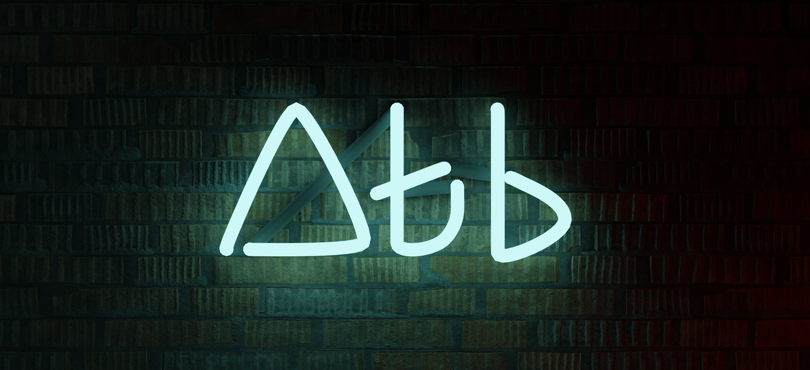

## 👋 Hi!

✨ I really enjoy creating interesting, maybe fabulous, open-source projects.

🧩 I love debugging weird issues to be able to make the next baby-step.
  
🧑‍💻 I'm currently working on [quickie](https://github.com/atahabaki/quickie).

## ⭐ Languages & Tools

## 📁 Projects

* [Phoenix Toolbox](https://github.com/atahabaki/phoenix-toolbox):
		Ease of use toolbox for android smartphones, designed for testers and rom developers.
* [WordBook](https://github.com/atahabaki/wordbook-android):
		An android app for linguists...
* [quickie](https://github.com/atahabaki/rustymd):
		Direct jump to search results. A browser extension which is serves the similar purpose of DuckDuckGo !Bangs.

## 📬 Links

